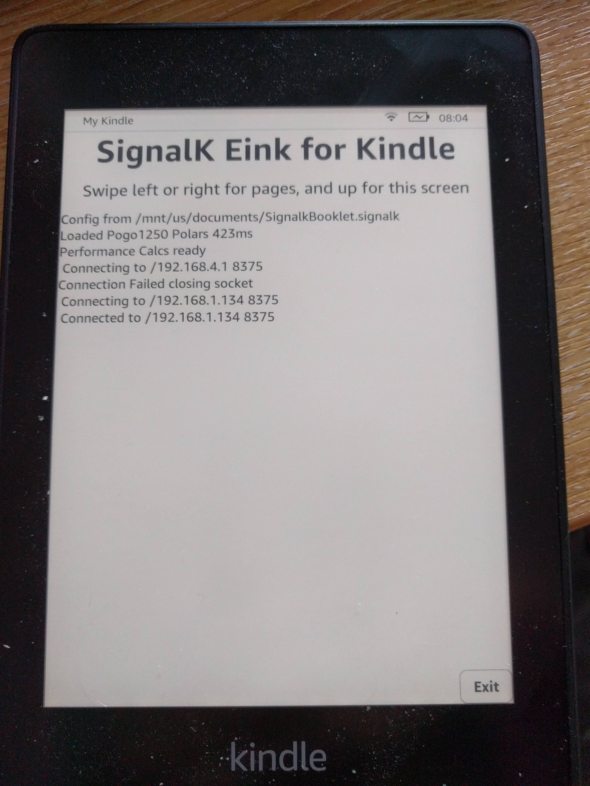
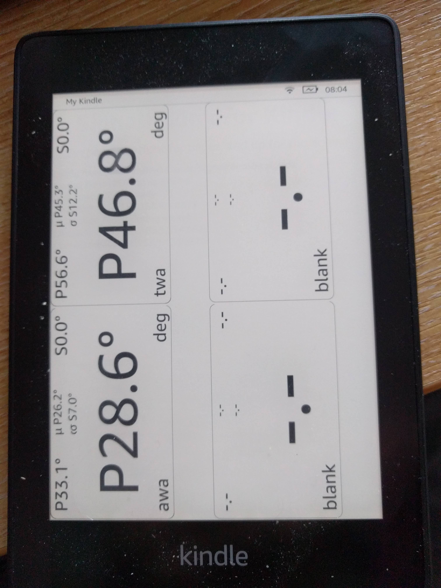
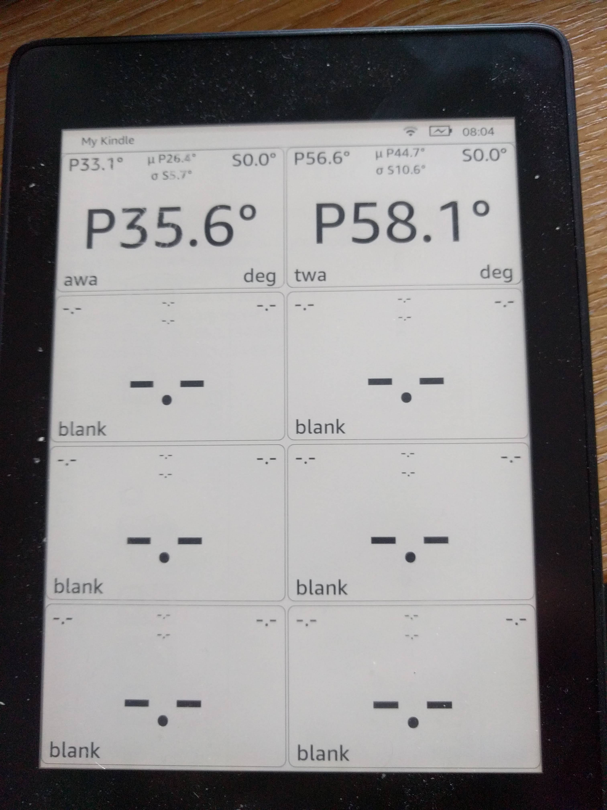
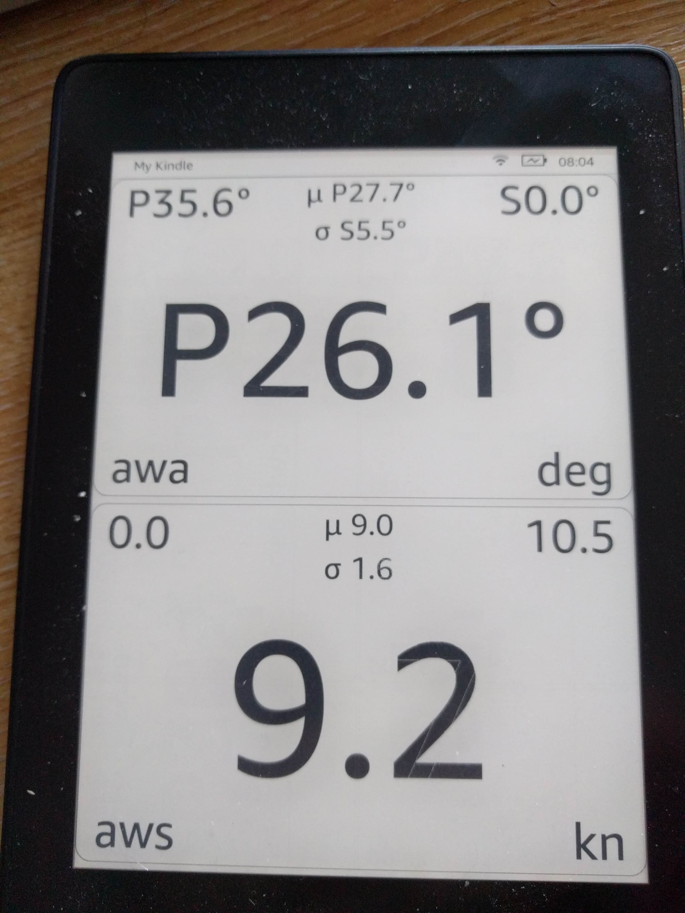
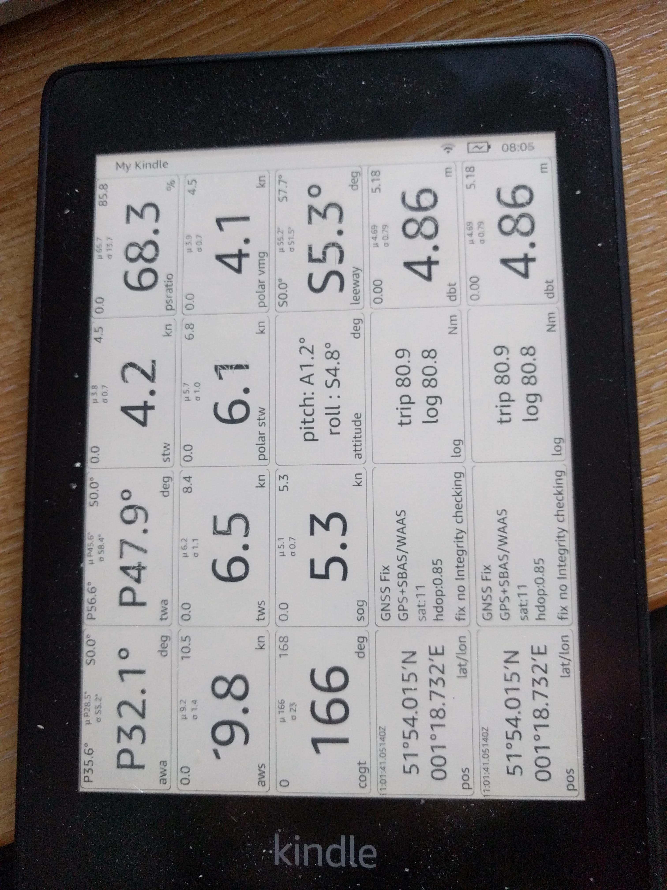

# NMEA2000 EInk Booklet

This is a Kindle Booklet for NMEA2000 data that allows you to open a book on a Kindle Paperwhite that displays pages
of graphical instruments that display real time data from a NMEA2000 HTTP server on the network supporting the CanDiagnose format. (see https://github.com/ieb/CanDiagnose) 

Kindle UIs are Java Swing applications running inside a lightweight OSGi Framework.

It recognises the mimetype of the "book" and launches the registered Booklet application (NMEA2000Booklet.java) which then 
reads the json inside the book file, configures the UI with pages of widgets (EInkTextBox.java).

It then either attempts to connect to a list of host port combinations from the book json. When 
it connects it also fetches the current state from the NMEA2000 REST API. 

When the booklet is running navigation is by finger swipes left and rig ht to change pages.

Multiple books may be added to the kindle over the USB Mount, placed in the documents folder. see config.json for 
an example of configuration.

Dont expect fantastic graphics animations. Kindle screens are great in full sunlight, but the eink technology is very slow
and requires careful slow redrawing to avoid shadows and ink left behind. The Paperwhite 4 is IP68 waterproof and the battery
lasts for many many hours. 

Photos are from the desktop version, however the Kindle UI is the same.

Some older Kindle UI photos

# Developing

You can run locally (Main.java)

# Kindle Architecture

see https://wiki.mobileread.com/wiki/Kindle_Touch_Hacking#Architecture worth reading to understand the internals before 
trying to use this project.

# Kindle setup

To use this app you need to get a developer key onto the Kindle. Recent Kindles have USBNetworking that allows you to 
login as root over IP (default password mario, as per https://www.sven.de/kindle/), put the root drive into writable and
install your developer key. You can also use packages from https://wiki.mobileread.com/wiki/Kindle_Touch_Hacking#Architecture 
to automate this however you may need to disable firmware updates to prevent your key from being deleted.

All Jars running on a Kindle must be signed by a key loaded onto the kindle so this step is required.

# Kindle 4 USBNetworking

This can be a bit confusing.  With KUAL and USBNetworking installed:

If you plug in the Kindle and it appears as a disk then USBNetworking is not enabled.
Check /Volumes/Kindle/usbnetworking/auto does not exist as this empty file will cause the Kindle to enter
usbnetworking at boot, which you may not want.

Then reboot with the USB cable disconnected.
Once booted, go to KUAL -> USBNetworking and ensure that SSK is enabled over USBNetworking.
Then Toggle USBNetworking
Wait about 60s for everyting to start.
Plugin the USB.
On OSX you should see a new Networking device RNDIS/Ethernet Gadget, and ifconfig should show a new network device that was not there previously.
Set the network address to static on 192.168.15.201/255.255.255.0
ssh root@192.168.15.244 (root password is probably mario, or install a ssh key when you get in.)

ifconfig should look like this 

         en6: flags=8863<UP,BROADCAST,SMART,RUNNING,SIMPLEX,MULTICAST> mtu 1500
            options=6467<RXCSUM,TXCSUM,VLAN_MTU,TSO4,TSO6,CHANNEL_IO,PARTIAL_CSUM,ZEROINVERT_CSUM>
            ether ee:49:00:00:00:00 
            inet6 fe80::75:ea96:e6d5:2107%en6 prefixlen 64 secured scopeid 0x15 
            inet 192.168.15.201 netmask 0xffffff00 broadcast 192.168.15.255
            nd6 options=201<PERFORMNUD,DAD>
            media: autoselect (100baseTX <full-duplex>)
            status: active

root login over ssh should look like this (once a ssh key is setup)

            $ ssh root@192.168.15.244
            Enter passphrase for key '~/.ssh/localhosts': 
            #################################################
            #  N O T I C E  *  N O T I C E  *  N O T I C E  # 
            #################################################
            Rootfs is mounted read-only. Invoke mntroot rw to
            switch back to a writable rootfs.
            #################################################
            [root@kindle root]# ps aux

# Developer setup

The maven build produces an installable package that can be installed with the MPRI package installed that is part of KUAL, 
however it has some dependencies. 

## Kindle SDK

AFAIK, Amazon doesn't distribute a Kindle SDK, and I can't distribute it, so you have to extract the API Jars from your Kindle. Copy the contents of 
/opt/amazon/ebook on the Kindle which should be symlinked to opt_amazon_ebook. That tree contains the SDK. This version
of the code is being built against Firmware version 5.10.0.1. Some of the classes are obfuscated and you may have to adjust
the code here if your Firmware is different.

## Java version

The Java version on a Kindle is an embedded JVM based on 1.8 (cvm). It has a cut down list of classes so many standard libraries
wont work. You will find a list of all classes in /usr/java/lib/classlist. The version of Swing is different from
a standard JDK with some methods missing and some behaviours different. Font point sizes dont correlate well to a standard
JDK after taking into account screen resolution. There are a number of Jars loaded into the OSGi framework, however Booklets
do not seem to be loaded as OSGi bundles and the normal classpath resolution process doesnt appear to work. You cant 
embed libraries into a jar and must unpack all the classes into the Jar that are required for a booklet. Simple JSON is 
available, but even simple things like parsing yaml with standard libraries doesnt work.

## Kindle tool

The final packaging and signing is performed using kindletool which can be found here https://github.com/NiLuJe/KindleTool

## Building

Building is achieved using mvn clean install. It will build the jar, build the package and put the result in target

## Installation

Copy the install image onto the kindle and run the MRPI package script. This will install the package and restart the Kindle UI.

eg 

        mvn clean install && \\
           scp  target/Update_NMEA2000_uk.co.tfd.kindle.nmea2000_976ed_install.bin  root@192.168.15.244:/mnt/us/mrpackages && \\
           ssh root@192.168.15.244  "/mnt/us/extensions/MRInstaller/bin/mrinstaller.sh launch_installer"

192.168.15.244 is the USBNet IP address of the Kindle when plugged in.
Installation will look something like below.

         x stop/waiting
         [FBInk] Detected a Kindle PaperWhite 4 (0PP -> 0x2F7 => Moonshine on Rex)
         [FBInk] Enabled Kindle Rex platform quirks
         [FBInk] Clock tick frequency appears to be 100 Hz
         [FBInk] Screen density set to 300 dpi
         [FBInk] Variable fb info: 1072x1448, 8bpp @ rotation: 3 (Counter Clockwise, 270°)
         [FBInk] Fontsize set to 24x24 (IBM base glyph size: 8x8)
         [FBInk] Line length: 44 cols, Page size: 60 rows
         [FBInk] Vertical fit isn't perfect, shifting rows down by 4 pixels
         [FBInk] Fixed fb info: ID is "mxc_epdc_fb", length of fb mem: 6782976 bytes & line length: 1088 bytes
         [FBInk] Pen colors set to #000000 for the foreground and #FFFFFF for the background
         [CLI] This is a non-interactive SSH session and stdin is *currently* empty, enforcing non-blocking behavior by aborting early!
         x start/running, process 21298

## Logs

slf4j logs to /var/tmp/nmea2000.log The slf4j settings are in the NMEA2000Booklet class. They must be set before any SLF4J classes
are created. 

## Booklets

Create files in /mnt/us/documents called .nmea2000 containing json (eg /mnt/us/documents/OnDeck.nmea2000), 
see src/test/resources/config.json for an example.

## CanDiagnose servers

Build and run https://github.com/ieb/N2KNMMEA0183Wifi on an ESP32 connected to your NMEA2000 network. It exposes http,websocket,
tcp and udp servers, as well as a mDNS responder. The tcp server emits NMEA0183 traffic and switches to N2K over SeaSmart sentences
on recpiept of a $PCDCM,1,0*58 message (or any other $PCDCM message from the kindle).

By default the booklet will discover the NMEA2000 server using mDNS, discovering _can-tcp._tcp.local, typically on port 10110.
On connect the booklet sends a $PCDCM message with a list of PGNs to filter on, or a zero list for no filtering. This
switches the ESP32 into SeaSmart mode. 

For mDNS to work on the Kindle the IP firewall on the kindle must be adjusted to allow the multicast packets on port 5353 be be sent and recieved. If running on a isolated network with 
no default router dont forget to add a default route to the routing table on the NMEA2000 server 
otherwise packets wont get routed off the nmea2000 server. This can be done by making the 
wifi network interface the router.

For the kindle firewall append the following to the UDP rules and restart the firewall.
    
    -A INPUT   -m pkttype --pkt-type multicast -j ACCEPT
    -A FORWARD -m pkttype --pkt-type multicast -j ACCEPT
    -A OUTPUT  -m pkttype --pkt-type multicast -j ACCEP

Once discovered the booklet will fetch the state of all data values every 5m from the http interface and process updates on the tcp port.
     
  
 # Customisation
 
 see src/test/resources/config.json for an example used on a Pogo1250 connected to a Raymarine SeatalkNG bus.
  
 The app comes with a set of datavalues and widgets, however you must configure which  datavalues and attach to which widgets to them. 
 DataValues have a path in the store which input values map to so that data updates with a matching
 path are collected by the data value. Some datavalues may collect updates from multiple paths. The datavalue will have SI units, and a type that determines how its units are treated and displayed.

 instruments display datavalues. An instrument has a key, a widget class and a path in the store that identifies which datavalue it displays.

The configuration also contains configuration for calculations and a polar map for performance. Thee are required.

  